# CENG 356 - Lab 3: ALU Circuit Design and Simulation with Logisim

**Student:** Solomon Ewusi
**Student ID:** N01659373
**Course:** CENG 356 - Computer Systems Architecture
**Institution:** Humber College

---

## Overview

This lab builds a complete 16-bit Arithmetic Logic Unit (ALU) in Logisim-evolution using the updated starter file `ALU2.circ` provided by the professor. The `main` circuit selects one of eight operations with a 3-bit `Control_Input` (S2 S1 S0): addition, subtraction, AND, OR, NOT, XOR, and logical left/right shifts. It also outputs four status flags (Zero, Sign, Carry, Overflow) generated by the Adder and Subtractor.

---

## Files

| File | Description |
|------|-------------|
| `ALU2.circ` | Logisim-evolution project containing `main` and all 8 subcircuits |
| `LAB 3 ONLINE REPORT - SOLOMON EWUSI.docx` | Lab report with screenshots and explanations for every function |
| `screenshots/` | 16 simulation screenshots (8 full-ALU tests in `main`, 8 subcircuit tests) |

---

## Work Completed

The starter file provided `main` (mostly wired), `BitWiseAnd`, and `AdderCircuit`. The remaining parts were built as follows.

### Subcircuits
- **BitWiseOR**: 16-bit OR gate between A and B
- **BitWiseNot**: 16-bit NOT gate on A
- **BitWiseXOR**: 16-bit XOR gate between A and B
- **ShiftLeft**: 16-bit Shifter set to *Logical Left*. A Bit Extender (16 bits in, 4 bits out) passes only B's lowest 4 bits to the shift-amount input, since a 16-bit value only needs a shift distance of 0-15.
- **ShiftRight**: same structure as ShiftLeft, with the Shifter set to *Logical Right*
- **SubtractorCircuit**: 16-bit Subtractor plus four flag outputs, following the same structure as `AdderCircuit`

### Flag logic (Adder and Subtractor)
- **Zero**: 16-input NOR of all result bits (1 only when the result is 0)
- **Sign**: bit 15 (MSB) of the result
- **Carry**: carry-out of the Adder / borrow-out of the Subtractor
- **Overflow**:
  - Adder (provided): `A15 · B15 · S15'`
  - Subtractor: `A15 · B15' · S15'` (a negative minus a positive giving a positive result)

### Changes in `main`
- Moved the Subtractor's new flag ports in **Edit Circuit Appearance** so Zero, Sign, Carry and Overflow line up with the wires the professor had already drawn in `main`
- Added a **4-bit 2-to-1 multiplexer** in the gap before the flag outputs. It is driven by S0, so S0 = 0 shows the Adder's flags and S0 = 1 shows the Subtractor's flags.

---

## How to Open and Simulate

### Requirements
- [Logisim-evolution v5.0.0](https://github.com/logisim-evolution/logisim-evolution/releases/tag/v5.0.0)
- (Classic Logisim 2.7.1 cannot open this file.)

### Steps
1. Open `ALU2.circ` in Logisim-evolution (File > Open).
2. Double-click `main` in the left panel.
3. Select the poke tool (hand icon, first in the toolbar).
4. Click bits on `InputA` and `InputB` to set test values.
5. Click bits on `Control_Input` to choose a function from the table below, then read `Output` and the four flags.

---

## Function Table and Results

All tests in `main` use **A = `0000000011110101` (00F5)** and **B = `0000000000000011` (0003)**.

| S2 S1 S0 | Function | Output (binary) | Hex |
|---|---|---|---|
| 000 | Addition | `0000000011111000` | 00F8 |
| 001 | Subtraction | `0000000011110010` | 00F2 |
| 010 | AND | `0000000000000001` | 0001 |
| 011 | OR | `0000000011110111` | 00F7 |
| 100 | NOT A | `1111111100001010` | FF0A |
| 101 | XOR | `0000000011110110` | 00F6 |
| 110 | Shift A left by B | `0000011110101000` | 07A8 |
| 111 | Shift A right by B | `0000000000011110` | 001E |

For Add and Subtract, all four flags are 0 with these inputs. The Subtractor's Overflow flag was also checked separately: A = 8000, B = 0001 gives 7FFF with Overflow = 1.

---

## Screenshots

### Full ALU (`main`)

| | |
|---|---|
|  **000 Add** |  **001 Subtract** |
| 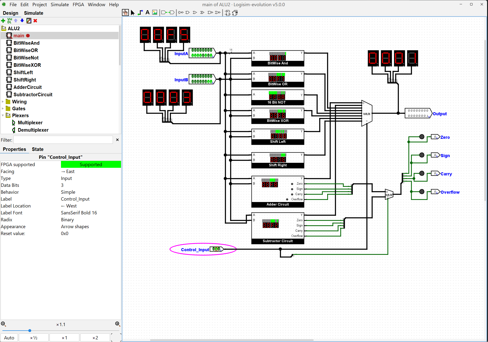 **010 AND** |  **011 OR** |
|  **100 NOT A** | 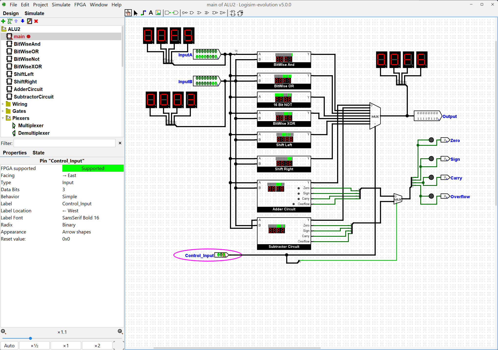 **101 XOR** |
| 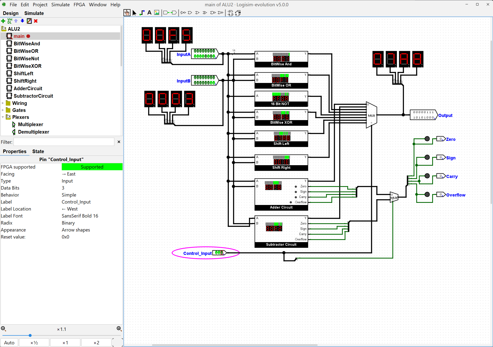 **110 Shift Left** |  **111 Shift Right** |

### Individual subcircuits

| | |
|---|---|
| 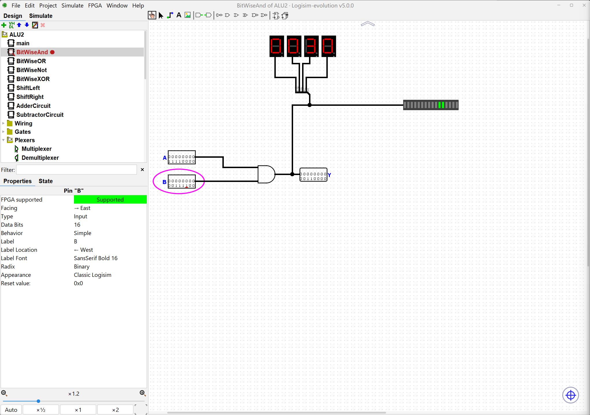 **BitWiseAnd**: 00F0 AND 003C = 0030 | 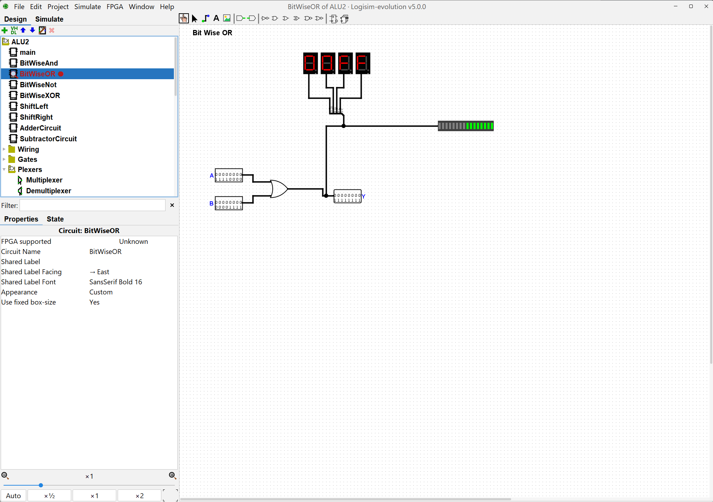 **BitWiseOR**: 00F0 OR 000F = 00FF |
| 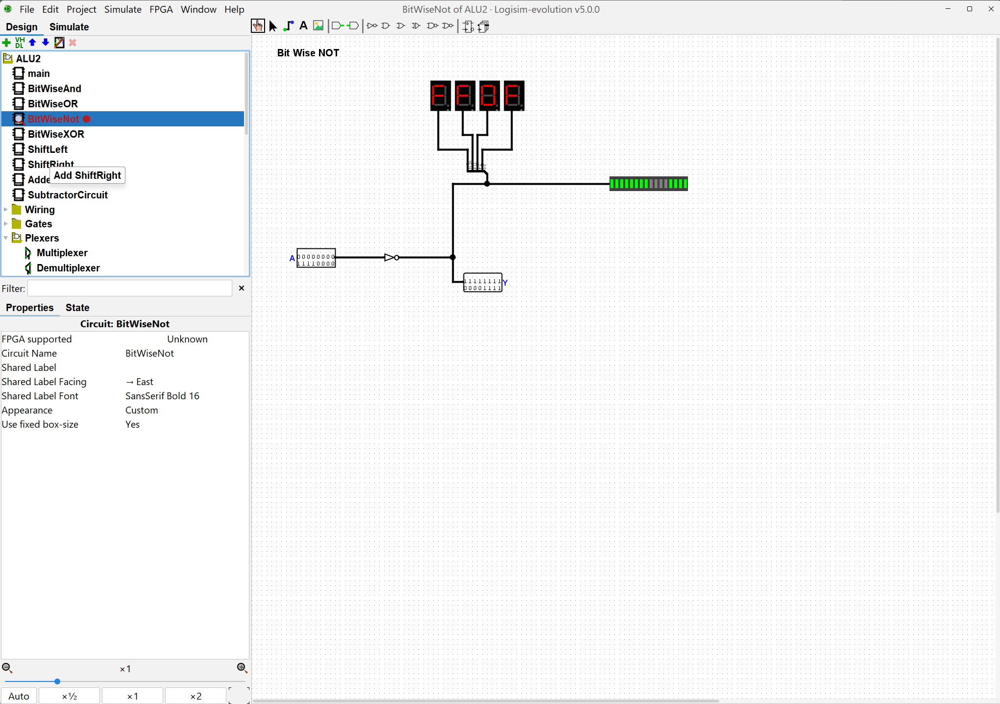 **BitWiseNot**: NOT 00F0 = FF0F | 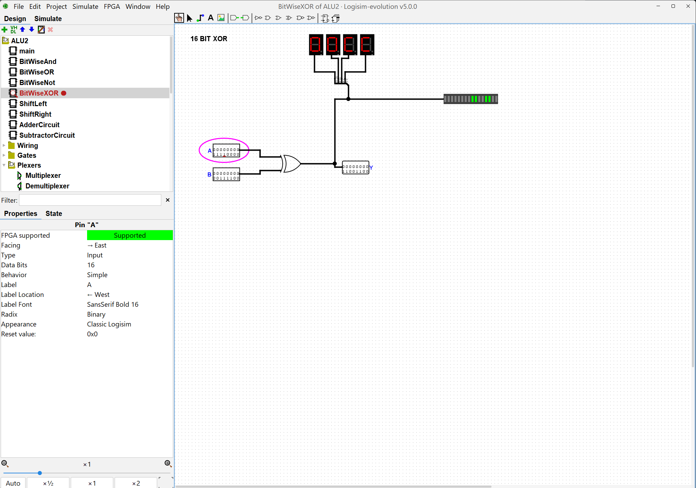 **BitWiseXOR**: 00F0 XOR 003C = 00CC |
| 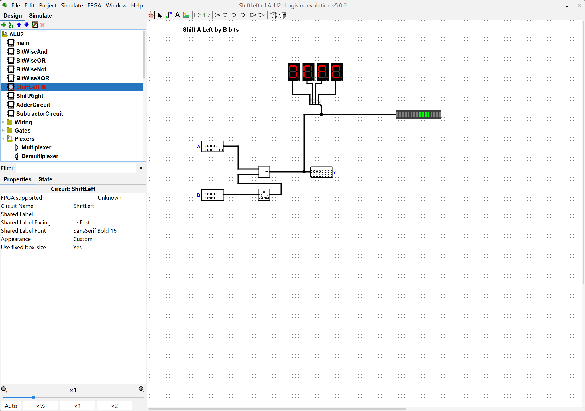 **ShiftLeft**: 000F << 4 = 00F0 | 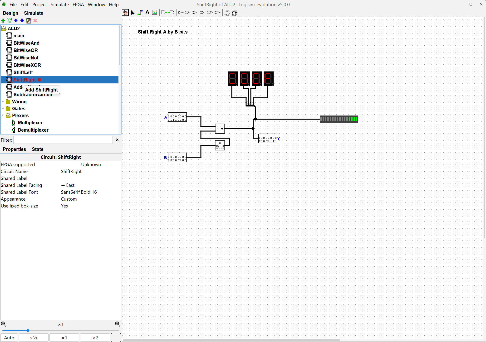 **ShiftRight**: 00F0 >> 4 = 000F |
| 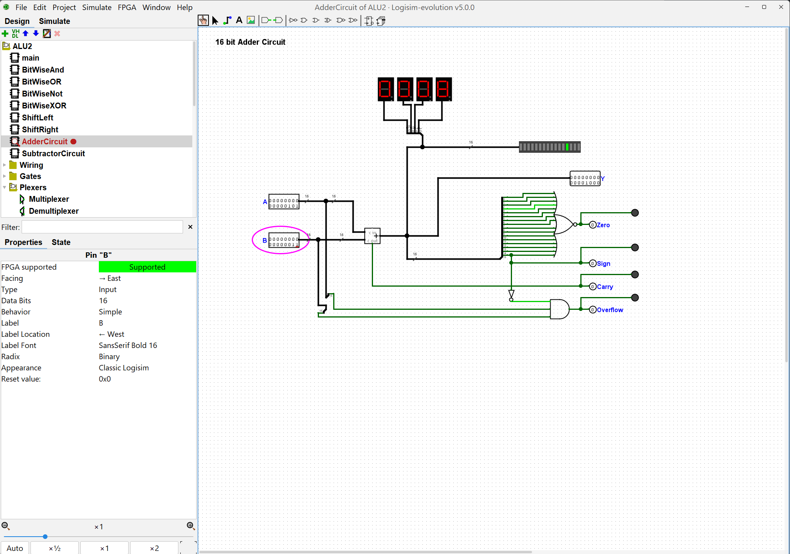 **AdderCircuit**: 5 + 3 = 8 | 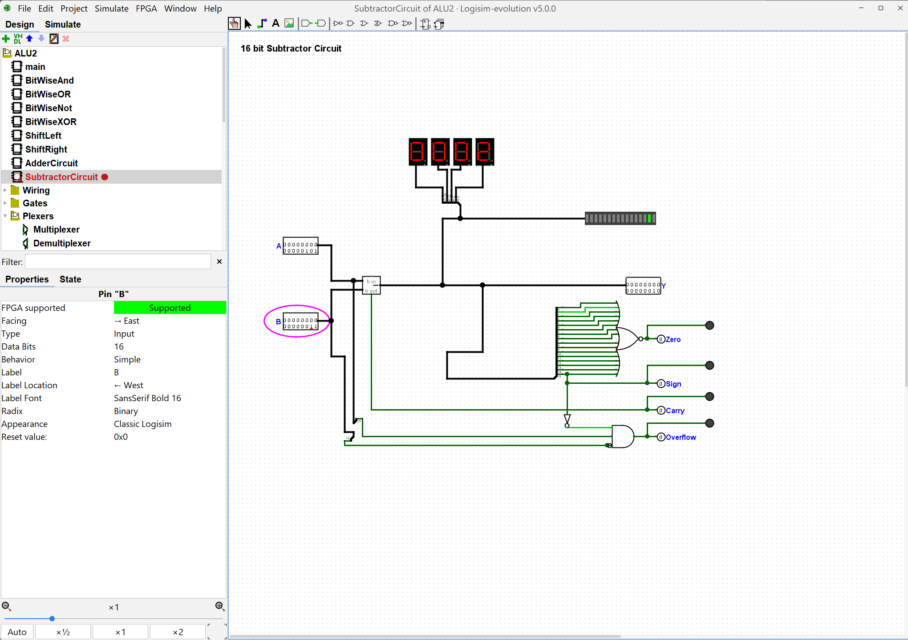 **SubtractorCircuit**: 5 - 3 = 2 |

---

## Notes

- The flags only carry meaning for Add (000) and Subtract (001). For other codes, the flag outputs still show whichever of the Adder or Subtractor S0 selects.
- In Logisim-evolution, wire colors are a quick debugging check: **black/green** means connected, **blue** means nothing is driving the wire, and **red** means an error such as a bit-width mismatch or a floating input.

---

## GitHub Repository
[https://github.com/SolomonEwusi9373/SolomonEwusiCENG356-Lab3](https://github.com/SolomonEwusi9373/SolomonEwusiCENG356-Lab3)
