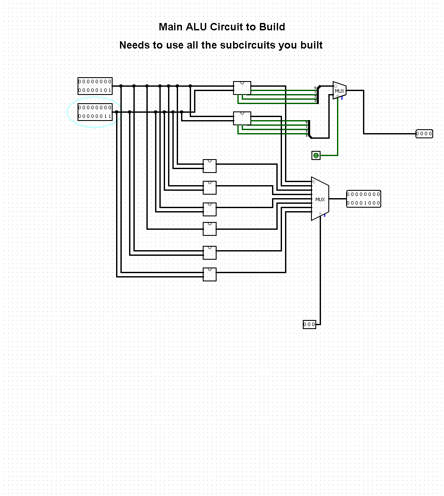
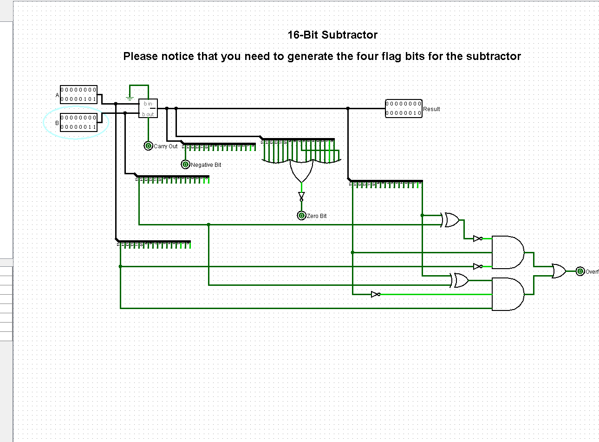
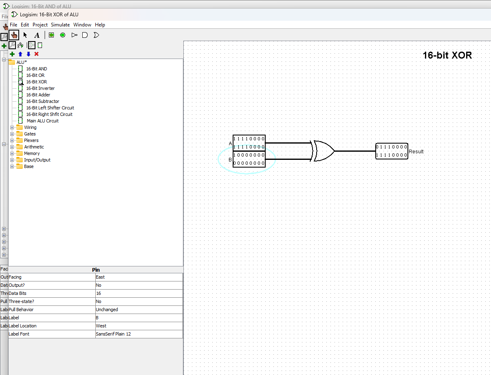
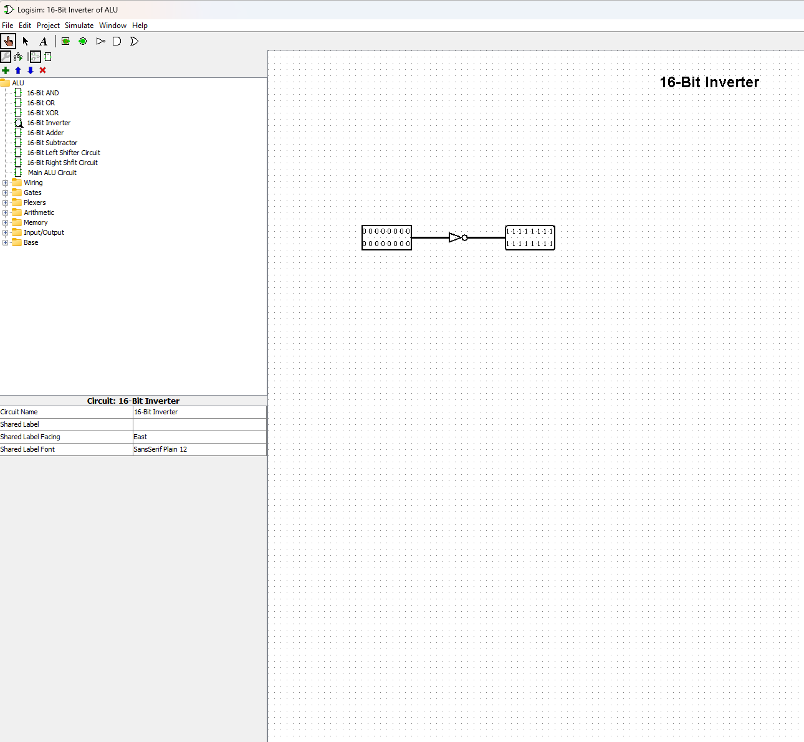
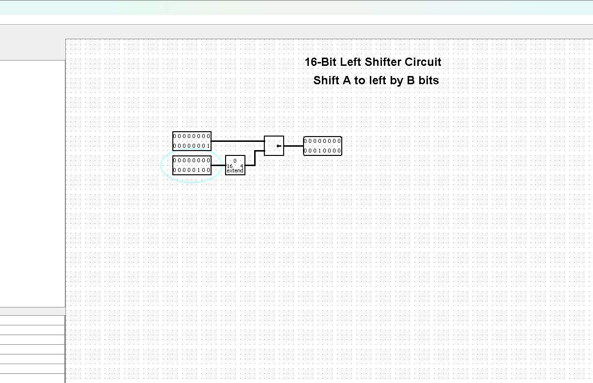
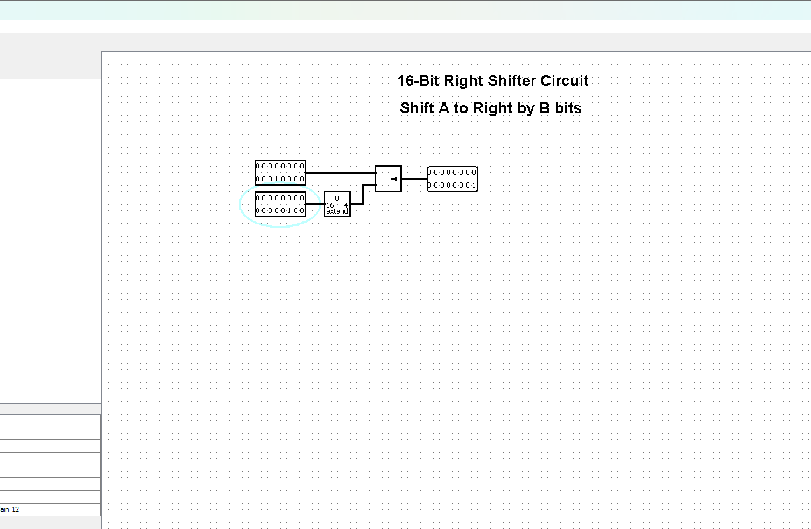

# CENG 356 - Lab 3: ALU Circuit Design and Simulation with Logisim

**Student:** Solomon Ewusi
**Student ID:** N01659373
**Course:** CENG 356 - Computer Systems Architecture
**Institution:** Humber College

---

## Overview

This lab builds a complete 16-bit Arithmetic Logic Unit (ALU) in Logisim from individual subcircuits, then combines them into a single Main ALU Circuit controlled by a 3-bit selector (S2, S1, S0). The ALU supports 8 operations: addition, subtraction, AND, OR, XOR, NOT, and logical left/right shifts, plus 4 status flag bits (Overflow, Carry, Negative, Zero) generated by the Adder and Subtractor.

---

## Files

| File | Description |
|------|-------------|
| `ALU.circ` | Logisim project file containing all 8 subcircuits and the Main ALU Circuit |

---

## Features Implemented

### Subcircuits
- **16-Bit AND** — bitwise AND of A and B
- **16-Bit OR** — bitwise OR of A and B
- **16-Bit XOR** — bitwise XOR of A and B
- **16-Bit Inverter** — bitwise NOT of A
- **16-Bit Adder** — computes A + B, with all 4 flag bits generated from the sum
- **16-Bit Subtractor** — computes A - B, with all 4 flag bits generated from the result
- **16-Bit Left Shifter** — shifts A left by the amount in B's lowest 4 bits
- **16-Bit Right Shifter** — shifts A right by the amount in B's lowest 4 bits

### Flag bit logic (Adder and Subtractor)
- **Carry-out** — taken directly from the adder/subtractor's carry-out signal
- **Zero** — set to 1 if the result is all zero
- **Negative** — equal to the MSB (bit 15) of the result
- **Overflow** — computed with the Boolean formula from the manual: `S15'A15(B15 XOR SUB) + S15A15'(B15 XOR SUB)'`

### Main ALU Circuit
- An 8-to-1 multiplexer selects between the 8 subcircuit results based on S2S1S0, per the function table below
- A 4-bit 2-to-1 multiplexer selects between the Adder's flags and the Subtractor's flags, controlled by S0 (so flags always match whichever of Add/Subtract is active)

---

## How to Open and Simulate

### Requirements
- Logisim version 2.7.1
- Java Runtime Environment

### Steps
1. Open `ALU.circ` in Logisim (File > Open)
2. Select a circuit from the left panel to view or edit it
3. Enable simulation: Simulate > Simulation Enabled
4. Use the poke tool (hand icon) to click individual bits of the input pins and set test values
5. Open **Main ALU Circuit** and set S2, S1, S0 to select a function per the table below

---

## Function Table and Results

| S2 S1 S0 | Function | A | B | Result | Decimal |
|---|---|---|---|---|---|
| 000 | Addition | `0000000000000101` (5) | `0000000000000011` (3) | `0000000000001000` | 8 |
| 001 | Subtraction | `0000000000000101` (5) | `0000000000000011` (3) | `0000000000000010` | 2 |
| 010 | Logic AND | `0000000000000101` (5) | `0000000000000011` (3) | `0000000000000001` | 1 |
| 011 | Logic OR | `1111000011110000` | `1000000000000000` | `1111000011110000` | — |
| 100 | Logic XOR | `1111000011110000` | `1000000000000000` | `0111000011110000` | — |
| 101 | NOT A | `0000000000000000` | (not used) | `1111111111111111` | — |
| 110 | Shift A right by B | `0000000000010000` (16) | `0000000000000100` (4) | `0000000000000001` | 1 |
| 111 | Shift A left by B | `0000000000000001` (1) | `0000000000000100` (4) | `0000000000010000` | 16 |

All 8 functions were tested and verified correct, both at the individual subcircuit level and through the Main ALU Circuit's selector logic.

---

## Screenshots

### Function 1: Addition (Main ALU Circuit)

### Function 2: Subtraction

### Function 3: Logic AND

### Function 4: Logic OR

### Function 5: Logic XOR

### Function 6: NOT A

### Function 7: Shift A left by B

### Function 8: Shift A right by B

---

## Notes

- The Overflow flag only triggers in meaningful addition/subtraction cases — for example, adding two large positive numbers that wrap into a negative result, or subtracting a large negative number from a large positive one. It does not apply to AND, OR, XOR, NOT, or the shifts, since those operations don't use the flag-generating logic from the Adder/Subtractor.
- The Left/Right Shifter circuits only use the lowest 4 bits of B as the shift amount, since a 16-bit value only ever needs a shift distance between 0 and 15. A Bit Extender component (configured to narrow 16 bits down to 4) is used to pull out just those bits.
- Logisim's `fflush`-style input quirks don't apply here since this is a GUI poke-tool simulation rather than a console program, but getting wires to register as connected (versus just visually overlapping) was the most common source of errors while building this circuit — always confirm a wire shows solid black (not red) before trusting a result.

---

## GitHub Repository
[https://github.com/SolomonEwusi9373/SolomonEwusiCENG356-Lab3](https://github.com/SolomonEwusi9373/SolomonEwusiCENG356-Lab3)
